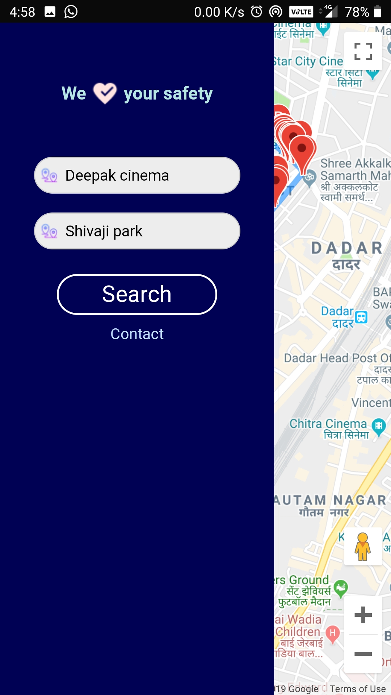
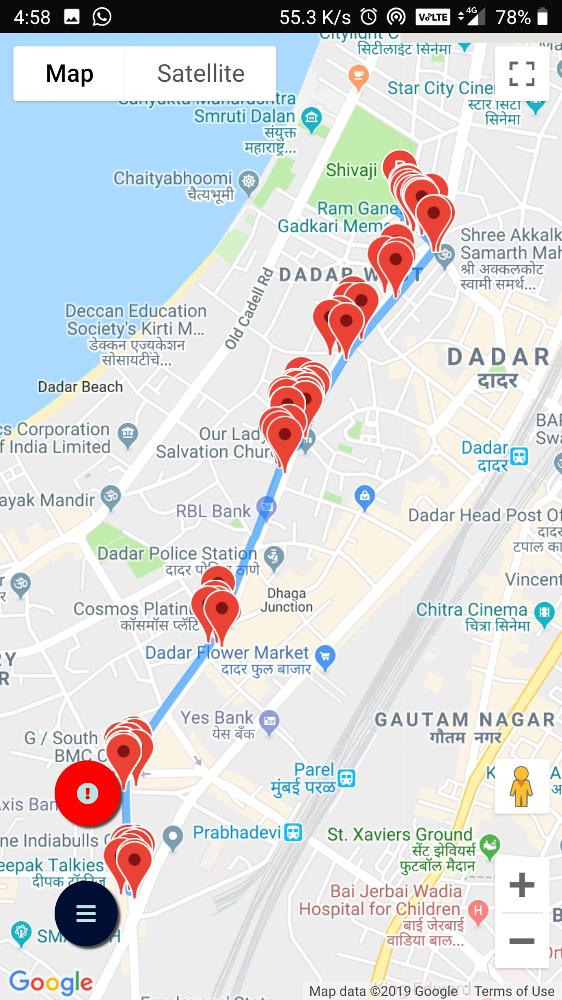
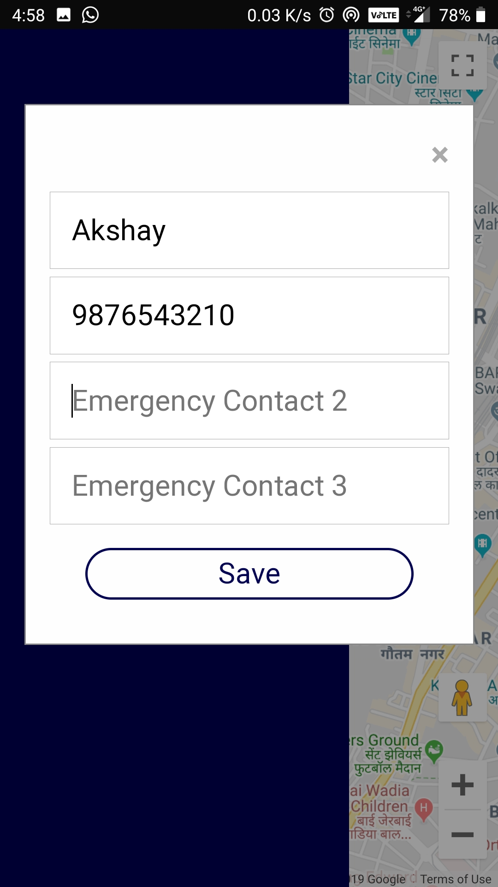

<div align = "center">

 </div>
<h3 align="center">Safe Travel Routes for a Happy Journey</h3>

<div align="center">

[](https://www.python.org/)

[](https://www.javascript.org/)

<br>

</div>

------------------------------------------

> Google Maps have changed the scope of navigation, it gives us the fastest route to a destination but it dosen't make sure that it is the safest route to reach your destination.

> Safely reached considers all the possible routes and gives you the shortest but also the **SAFEST** route for your journey.

> The `safest route` is chosen on the basis of the liveliness on a particular street like open restaurants, pharmacies, petrol pumps, hospitals etc.

> If it not possible to find a route with optimum level of safety there is an option to send an SOS alert to their close ones.

##### Web-App

<div align = "center">

<br/><br/>

<br/><br/>

<br/><br/>

</div>

------------------------------------------
### Installation and Deployment

Add the Google Maps API key in `.env`

Using Docker
```
docker build . -t safelyreached
docker run -p 5000:5000 safelyreached
```

Using Python
```
python3 app.py
```

------------------------------------------

### Future Add-Ons

* [ ] In case of extreme emergencies an alert can be sent to the respective police authorities.
* [ ] Taking into consideration the traffic congestion on the streets.

------------------------------------------

### Contributing

 We're are open to `enhancements` & `bug-fixes` :smile: Also do have a look [here](./CONTRIBUTING.md)

### Note

 This project was done under `30 hours with minimal pre-preparation` 

------------------------------------------

### Contributors

* [@hetzz](https://github.com/hetzz)
* [@Rusherrg](https://github.com/RusherRG)
* [@akshay-99](https://github.com/akshay-99)

------------------------------------------

This repository / project was a part of SVNIT DotSlash Hackathon 2k19 which secured a 2nd runners up position.  
